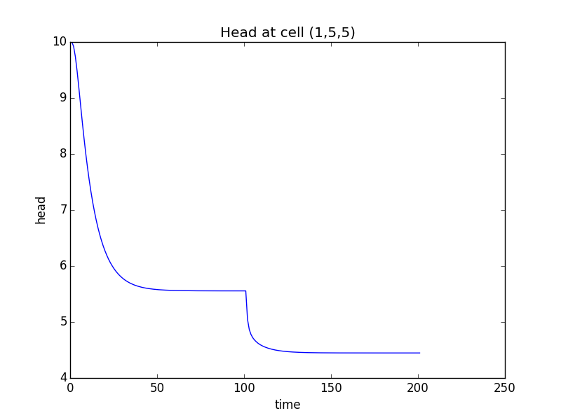

Tutorial 2: Unconfined Transient Flow Model
===========================================

In this example, we will convert the tutorial 1 model into an unconfined, transient flow model with time varying boundaries. Instead of using constant heads for the left and right boundaries (by setting ibound to -1), we will use general head boundaries.  We will have the model consider the following conditions:

* Initial conditions -- head is 10.0 everywhere
* Period 1 (1 day) -- steady state with left and right GHB stage = 10.
* Period 2 (100 days) -- left GHB with stage = 10., right GHB with stage set to 0.
* Period 3 (100 days) -- pumping well at model center with rate = -10., left and right GHB = 10., and 0.

We will start with selected model commands from the previous tutorial.

Getting Started
---------------
As shown in the previous tutorial, import flopy using your preferred method, such as::

    import flopy

Creating the MODFLOW Model
--------------------------

Define the Model Extent, Grid Resolution, and Characteristics
^^^^^^^^^^^^^^^^^^^^^^^^^^^^^^^^^^^^^^^^^^^^^^^^^^^^^^^^^^^^^

Assign the model information::

    #model domain and grid definition
    Lx = 1000.
    Ly = 1000.
    ztop = 0.
    zbot = -50.
    nlay = 1
    nrow = 10
    ncol = 10
    delr = Lx / ncol
    delc = Ly / nrow
    delv = (ztop - zbot) / nlay
    botm = np.linspace(ztop, zbot, nlay + 1)
    hk = 1.
    vka = 1.
    sy = 0.1
    ss = 1.e-4
    laytyp = 1

    # Variables for the BAS package
    # Note that changes from the previous tutorial!
    ibound = np.ones((nlay, nrow, ncol), dtype=np.int32)
    strt = 10. * np.ones((nlay, nrow, ncol), dtype=np.float32)

Define the Stress Periods
^^^^^^^^^^^^^^^^^^^^^^^^^

To create a model with multiple stress periods, we need to define nper, perlen, nstp, and steady.  This is done in the following block in a manner that allows us to pass these variable directly to the discretization object::

    nper = 3
    perlen = [1, 100, 100]
    nstp = [1, 100, 100]
    steady = [True, False, False]

Create Time-Invariant Flopy Objects
^^^^^^^^^^^^^^^^^^^^^^^^^^^^^^^^^^^

With this information, we can now create the static flopy objects that do not change with time::

    #flopy objects
    modelname = 'tutorial2'
    mf = flopy.modflow.Modflow(modelname, exe_name='mf2005')
    dis = flopy.modflow.ModflowDis(mf, nlay, nrow, ncol, delr=delr, delc=delc,
                                   top=ztop, botm=botm[1:],
                                   nper=nper, perlen=perlen, nstp=nstp, steady=steady)
    bas = flopy.modflow.ModflowBas(mf, ibound=ibound, strt=strt)
    lpf = flopy.modflow.ModflowLpf(mf, hk=hk, vka=vka, sy=sy, ss=ss, laytyp=laytyp)
    pcg = flopy.modflow.ModflowPcg(mf)

Transient General-Head Boundary Package
^^^^^^^^^^^^^^^^^^^^^^^^^^^^^^^^^^^^^^^

At this point, our model is ready to add our transient boundary packages.  First, we will create the GHB object, which is of the following type: `flopy.modflow.ModflowGhb <mfghb.html>`__.

The key to creating Flopy transient boundary packages is recognizing that the boundary data is stored in a three dimensional list (i.e. bnddata = [[[]]] ).  The innermost part of this list is a single boundary condition.  For a GHB it is [layer, row, column, stage, conductance].  The next outermost part is a list of all the boundaries for a single stress period.  The outermost list contains a group of boundaries for each stress period.::

    #make list for stress period 1
    stageleft = 10.
    stageright = 10.
    bound_sp1 = []
    for il in xrange(nlay):
        condleft = hk * (stageleft - zbot) * delc
        condright = hk * (stageright - zbot) * delc
        for ir in xrange(nrow):
            bound_sp1.append([il + 1, ir + 1, 0 + 1, stageleft, condleft])
            bound_sp1.append([il + 1, ir + 1, ncol - 1, stageright, condright])
    print 'Adding ', len(bound_sp1), 'GHBs for stress period 1.'

    #make list for stress period 2
    stageleft = 10.
    stageright = 0.
    condleft = hk * (stageleft - zbot) * delc
    condright = hk * (stageright - zbot) * delc
    bound_sp2 = []
    for il in xrange(nlay):
        for ir in xrange(nrow):
            bound_sp2.append([il + 1, ir + 1, 0 + 1, stageleft, condleft])
            bound_sp2.append([il + 1, ir + 1, ncol - 1, stageright, condright])
    print 'Adding ', len(bound_sp2), 'GHBs for stress period 2.'

    #We do not need to make a list for stress period 3.
    #Flopy will automatically take the list and apply it
    #to the end of the simulation, if necessary
    boundlist = [bound_sp1, bound_sp2]

    #Create the flopy ghb object
    ghb = flopy.modflow.ModflowGhb(mf, layer_row_column_data=boundlist)

Transient Well Package
^^^^^^^^^^^^^^^^^^^^^^

Now we can create the well package object, which is of the type, `flopy.modflow.ModflowWel <mfwel.html>`__.::

    pumping_rate = -100.
    wel_sp1 = [[1, nrow/2, nrow/2, 0.]]
    wel_sp2 = [[1, nrow/2, nrow/2, 0.]]
    wel_sp3 = [[1, nrow/2, nrow/2, pumping_rate]]
    welllist = [wel_sp1, wel_sp2, wel_sp3]
    wel = flopy.modflow.ModflowWel(mf, layer_row_column_data=welllist)

Output Control
^^^^^^^^^^^^^^

Here we create the output control package object, which is of the type `flopy.modflow.ModflowOc <mfoc.html>`__.::

    words = ['head','drawdown','budget', 'phead', 'pbudget']
    save_head_every = 1
    oc = flopy.modflow.ModflowOc(mf, words=words, save_head_every=save_head_every)

Running the Modeling
--------------------

Run the model with run_model2, which returns a success flag and the stream of output. With run_model2, we have some finer control, that allows us to suppress the output.::

    #write the model input files
    mf.write_input()

    #run the model
    success, mfoutput = mf.run_model2(silent=True, pause=False)
    if not success:
        raise Exception('MODFLOW did not terminate normally.')

Post-Processing the Results
---------------------------

Once again, we can read heads from the MODFLOW binary output file, using the `flopy.utils.binaryfile <binaryfile.html>`__ module. Included with the HeadFile object are several methods that we will use here:
* get_times() will return a list of times contained in the binary head file
* get_data() will return a three-dimensional head array for the specified time
* get_ts() will return a time series array [ntimes, headval] for the specified cell

Using these methods, we can create head plots and hydrographs from the model results.::

    #imports
    import matplotlib.pyplot as plt
    import flopy.utils.binaryfile as bf

    #Create the headfile object
    headobj = bf.HeadFile(modelname+'.hds')
    times = headobj.get_times()

    #Setup contour parameters
    levels = np.arange(1, 10, 1)
    extent = (delr/2., Lx - delr/2., delc/2., Ly - delc/2.)
    print 'Levels: ', levels
    print 'Extent: ', extent

    mytimes = [1.0, 101.0, 201.0]
    for iplot, time in enumerate(mytimes):
        print '*****Processing time: ', time
        head = headobj.get_data(totim=time)
        #Print statistics
        print 'Head statistics'
        print '  min: ', head.min()
        print '  max: ', head.max()
        print '  std: ', head.std()

        #Create the plot
        #plt.subplot(1, len(mytimes), iplot + 1, aspect='equal')
        plt.subplot(1, 1, 1, aspect='equal')
        plt.title('stress period ' + str(iplot + 1))
        plt.imshow(head[0, :, :], extent=extent, cmap='BrBG', vmin=0., vmax=10.)
        plt.colorbar()
        CS = plt.contour(head[0, :, :], levels=levels, extent=extent)
        plt.clabel(CS, inline=1, fontsize=10, fmt='%1.1f')
        plt.show()

    plt.show()

If everything has worked properly, you should see the following head contours.

.. figure:: _images/tutorial2fig1.png
   :alt: head contours for stress period 1
   :scale: 100 %
   :align: center

.. figure:: _images/tutorial2fig2.png
   :alt: head contours for stress period 2
   :scale: 100 %
   :align: center

.. figure:: _images/tutorial2fig3.png
   :alt: head contours for stress period 3
   :scale: 100 %
   :align: center

Plot Head Versus Time
^^^^^^^^^^^^^^^^^^^^^
Make a plot of head versus time by extracting the binary heads from the headobj::

    ts = headobj.get_ts(1, nrow/2, ncol/2)
    plt.subplot(1, 1, 1)
    ttl = 'Head at cell ({0},{1},{2})'.format(1, nrow/2, ncol/2)
    plt.title(ttl)
    plt.xlabel('time')
    plt.ylabel('head')
    plt.plot(ts[:, 0], ts[:, 1])

